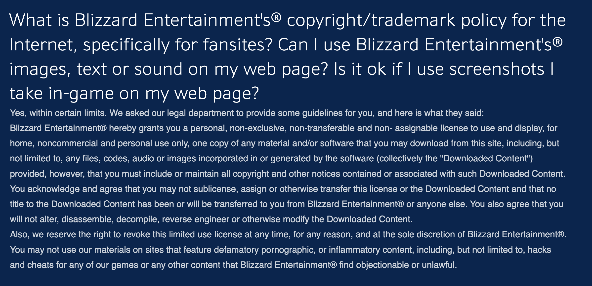

# Engineering Design Document (EDD)

## Project: Counters.to Web Frontend

**Status:** Draft
**Architecture:** Static SvelteKit site (`adapter-static`, fully prerendered), consuming the flat-file-compiled REST API from `counters-data-core`

## 1. Objective & Scope

This specification defines the frontend that consumes the static JSON API produced by `packages/counters-data-core` (see `docs/counters.to backend EDD.md`). It covers stack choice, directory layout, data-fetching and offline strategy, routing/page map, state management, local dev environment, build/deploy to GitHub Pages, and testing.

This package is licensed **GPLv3**, separately from `counters-data-core` (MIT). See section 11.

### 1.1 Feature staging

Priority is speed to market without boxing in later features. Three tiers:

- **MVP** — select a single hero, see what mechanics it's weak to and which heroes exploit them. Pure static navigation between prerendered pages, zero client-side state, zero new backend data. Ships on what's already compiled today.
- **V2** — multi-select both enemy and allied heroes (both uncapped), see merged weaknesses across the enemy selection, plus — once allied heroes are also picked — which selected enemies specifically threaten your current picks ("grief" notices) and suggested counter-picks. Reuses each hero's existing `threats`/`advantages` data client-side; no new backend endpoint. Does need one backend data addition: `distance` and `speed` as mechanics (see section 4.2).
- **V3 (reconsider after V2 ships)** — role-locked team-builder with scored/ranked suggestions and a 5v5/6v6 slot-count toggle. Needs a new `matchups/index.json` backend endpoint and a scoring algorithm. Likely redundant with what V2 already delivers via the simpler cross-referencing approach — revisit whether it's still worth building once V2 is live and there's real usage to learn from.

Sections below are tagged **[MVP]**, **[V2]**, or **[V3]** where the distinction matters.

## 2. Stack

- **SvelteKit** (Svelte 5, runes), **TypeScript**, **Vite** (SvelteKit is Vite-based)
- **`@sveltejs/adapter-static`** — prerenders every route to plain HTML/CSS/JS at build time, no server at runtime
- **`@vite-pwa/sveltekit`** for service worker + manifest generation (same Workbox foundation, same author/ecosystem as the Vue-targeted `vite-plugin-pwa`)
- No separate router library — file-based routing is built into SvelteKit
- No external state library — Svelte 5 runes (`$state`, `$derived`) in plain `.svelte.ts` modules cover this app's small shared-state needs, introduced starting at V2 (see section 6)

### Why TypeScript 6.x, not the 7.x line

Pinned via a root-level npm `overrides` entry (`"typescript": "^6.0.3"`), not just each package's own `devDependencies` — `svelte-check`'s own internal dependency on `typescript` resolves independently of what this repo declares, so matching versions in our own `package.json` files wasn't sufficient on its own; the override forces one deduplicated `typescript` across the whole install.

The reason isn't a stance on 7.x itself — it's that `svelte-check` (as currently published) crashes outright against it (`Cannot read properties of undefined (reading 'useCaseSensitiveFileNames')`), and `@sveltejs/kit` plus every `typescript-eslint` subpackage independently resolve to the 6.x line on their own whenever both are available, which is a strong signal the SvelteKit/svelte-check/typescript-eslint toolchain hasn't caught up to 7.x's new module shape yet. Nothing to do here but wait — revisit once those packages ship versions that explicitly support 7.x. Given this app's total source surface (per the directory blueprint in section 3) stays in the range of a few dozen files even through V3, 7.x's main draw — much faster type-checking on large codebases — isn't a compelling reason to fight the toolchain in the meantime.

### Why SvelteKit over plain Svelte + a router

Real Svelte apps overwhelmingly use SvelteKit rather than hand-rolled Vite+Svelte+router setups — it's the maintained, idiomatic path, with file-based routing and `load` functions as first-class concepts rather than something bolted on.

### Why SvelteKit over Nuxt

This is the fairer comparison than "Nuxt vs. plain Vue SPA" was. Nuxt's `generate` mode can also produce a fully static, prerendered site, so the SEO benefit isn't unique to SvelteKit. Two things still tip it: a preference for Svelte's compiled-away runtime (smaller bundles matter for an offline-first PWA — less to download and precache), and SvelteKit's static-adapter mode is a cleaner "this will never have a server" story — Nuxt's hybrid-rendering machinery (server routes, multiple rendering modes) exists whether or not `generate` mode uses it, which is unused complexity for a project that will never run a Node server.

### Why not Pinia-equivalent state management

Svelte 5 runes are built into the compiler, not a library choice — `$state`/`$derived` in a `.svelte.ts` module *is* the idiomatic shared-state pattern here, not a stepping-stone to something heavier.

## 3. Directory Structure Blueprint

### 3.1 Organization principle

Default to colocating a component or state module inside the route that owns it. SvelteKit ignores any file or directory under `routes/` prefixed with `_`, which gives a clean, router-safe place for scenario-scoped code that isn't itself a route. Promote something to `src/lib/` only once a second, genuinely unrelated scenario actually needs it — not preemptively. This keeps each feature area (hero detail, the home/counter-finder flow, the V3 team-builder) navigable and deletable as a self-contained unit, while `src/lib/` stays limited to what's actually shared.

```
packages/counters-web/
├── static/                        # SvelteKit's equivalent of Vue's public/ — copied to build output as-is
│   ├── api/v1/                    # compiled output from counters-data-core — NOTE: path changes, see section 9
│   └── CNAME                      # "counters.to" — see section 9
├── src/
│   ├── app.html
│   ├── routes/
│   │   ├── +layout.svelte              # global layout, mounts lib/components/OfflineBanner.svelte
│   │   ├── +page.svelte                # "/" — MVP: static hero grid. V2: same route gains interactive multi-select.
│   │   ├── +page.ts                    # load function: heroes/index.json
│   │   ├── _components/                # scenario: home / counter-finder — used only here
│   │   │   ├── RoleFilterBar.svelte        # [MVP]
│   │   │   ├── ThreatSummaryPanel.svelte   # [V2]
│   │   │   └── GriefNoticePanel.svelte     # [V2]
│   │   ├── _state/
│   │   │   └── heroSelection.svelte.ts     # [V2] Set-based allied/enemy selection (section 6.2), scoped to this scenario
│   │   ├── heroes/
│   │   │   └── [id]/
│   │   │       ├── +page.svelte        # [MVP] single-hero weakTo + threats detail
│   │   │       └── +page.ts            # load fn + `entries()` export enumerating all 51 hero ids for prerendering
│   │   ├── team-builder/               # [V3 — reconsider after V2] self-contained scenario
│   │   │   ├── +page.svelte
│   │   │   ├── _components/
│   │   │   │   └── TeamSlotPicker.svelte   # only used here
│   │   │   └── _state/
│   │   │       └── teamBuilder.svelte.ts   # role-locked slots, 5v5/6v6 mode toggle, scoring
│   │   └── about/
│   │       └── +page.svelte            # [MVP]
│   ├── lib/
│   │   ├── components/                     # only things used by 2+ scenarios
│   │   │   ├── HeroCard.svelte                 # home grid (MVP/V2) + team-builder slot picker (V3)
│   │   │   ├── MatchupBadge.svelte             # hero-detail (MVP) + home panels (V2)
│   │   │   ├── CounterSuggestionsPanel.svelte  # home (V2) + team-builder (V3, extended)
│   │   │   └── OfflineBanner.svelte            # global, root layout
│   │   ├── state/
│   │   │   └── onlineStatus.svelte.ts      # genuinely global, not scenario-specific
│   │   └── types/
│   │       └── api.ts                      # shared data contract, mirrors compiled JSON shapes
├── Dockerfile                         # local dev / offline testing, see section 8
├── vite.config.ts
├── svelte.config.js                   # adapter-static config
└── package.json

docker-compose.yml                     # repo root — see section 8
.env.example                           # repo root — see section 8
```

## 4. Data Layer

### 4.1 MVP: already fully covered

`heroes/index.json` (grid) and `heroes/:id/index.json` (detail, including `threats` and `advantages`) are already compiled and committed today. MVP needs no backend changes at all.

### 4.2 V2 backend dependency: `distance` and `speed` mechanics

The recurring example motivating V2 (dive tanks like Wrecking Ball or Hazard being especially vulnerable to Brigitte's Whip Shot, since it creates separation they need a — possibly already-spent — gap-closer to undo) isn't fully captured by the existing mechanics vocab. `knockback` already exists and covers the immediate hit; `distance` and `speed` are being added as their own mechanics to capture the broader kiting/separation dynamic (sustained range advantage, disengage tools) distinct from a single knockback effect.

This is real data-authoring work, not a one-line schema change: add `distance`/`speed` to `registry.yaml`, then re-author `weakTo`/`strongTo` for the heroes where they actually apply (dive/melee-dependent heroes on the weak side; kiting/poke/disengage-capable heroes on the strong side). Known accepted limitation: this still models kit traits statically, not cooldown/sequencing state (e.g., "already used their gap-closer") — full sequencing modeling is a much bigger change, out of scope here.

No new endpoint needed — V2 still only reads each selected hero's existing `threats`/`advantages` arrays, just with a richer mechanics vocabulary behind them.

### 4.3 V3 backend dependency: `matchups/index.json`

A role-locked scored team-builder needs pairwise matchup data for multiple heroes at once more efficiently than N individual deep fetches. Shape, if built:

```
GET /api/v1/matchups
Physical path: static/api/v1/matchups/index.json (path per section 9)
```

```json
{
  "data": [
    { "heroId": "sigma", "threatFrom": "zarya", "matchedTraits": ["beam"] },
    { "heroId": "sigma", "advantageOver": "dva", "matchedTraits": ["projectile"] }
  ]
}
```

~2,600 entries at 51 heroes. **Don't build this until V3 is actually greenlit** — per section 1.1, V2 may make it unnecessary.

### 4.4 Fetching & caching contract

- **[MVP]** `src/routes/+page.ts` and `src/routes/heroes/[id]/+page.ts` `load()` functions fetch `heroes/index.json` and `heroes/:id/index.json` respectively — since every route is prerendered (section 9), these fetches happen once at build time, not per-visitor. No client-side fetches at all for MVP.
- **[V2]** `routes/_state/heroSelection.svelte.ts` (section 6.2) fetches each newly-selected hero's `heroes/:id/index.json` client-side as it's added to either selection set, caching by id for the session so re-selecting doesn't refetch.
- **[V3]** would fetch `matchups/index.json` once on first visit to `/team-builder`, if built.
- All fetches are plain `fetch()` — no data-fetching library needed at this scale (no retries, no pagination, no mutations against a read-only static API).

### 4.5 Offline strategy (`@vite-pwa/sveltekit`)

- **Precache** (install-time, via Workbox `globPatterns`): the prerendered app shell — since every route is static HTML at build time (section 9), this precaches the whole MVP experience by itself, including every hero detail page.
- **Runtime cache** (`StaleWhileRevalidate`): `/api/v1/**`, covering V2's client-side per-hero fetches (and V3's `matchups` fetch, if built) — serves instantly from cache, refreshes in the background. Appropriate because this data only changes on redeploy (hero balance patches), not in real time.
- `lib/components/OfflineBanner.svelte` reads `lib/state/onlineStatus.svelte.ts` (wraps `navigator.onLine` + `online`/`offline` events) and shows a small persistent notice when offline — data is still fully usable, just not guaranteed fresh. Both live in `lib/` since the banner is global (root layout), not scoped to one scenario.

## 5. Routing / Page Map

| Route (file) | Stage | Purpose |
|---|---|---|
| `src/routes/+page.svelte` (`/`) | MVP → V2 | MVP: static hero grid, filterable by role, searchable by name, links to detail pages. V2: same route gains interactive multi-select (allied + enemy, both uncapped) with inline weakness/threat/suggestion panels. |
| `src/routes/heroes/[id]/+page.svelte` | MVP | Playbook, tactical caveats, threats list, advantages list for one hero. Stays useful post-V2 as a direct/shareable/SEO-friendly link even once the interactive tool exists. |
| `src/routes/team-builder/+page.svelte` | V3 (reconsider) | Role-locked (1 tank/2/2 for 5v5, up to 2 tanks/2/2 for 6v6 via a mode toggle), scored counter suggestions from the `matchups` fetch. |
| `src/routes/about/+page.svelte` | MVP | Project description, license summary, Blizzard IP attribution (section 11). |

Since every route is known and prerendered at build time (all 51 hero ids via `entries()`, plus the static routes), GitHub Pages doesn't need the usual SPA-on-static-hosting `404.html`-redirects-to-`index.html` workaround — every real URL has a real prerendered HTML file already. A genuine `src/routes/+error.svelte` still handles truly nonexistent hero ids (a real 404, not a routing hack).

## 6. Feature Logic by Stage

### 6.1 MVP: no logic

The hero-detail route renders `threats` (grouped by `matchedTraits`) directly from the already-compiled JSON. No aggregation, no client-side computation — this is why MVP needs no state module at all (section 3).

### 6.2 V2: multi-select and cross-referencing

State (`routes/_state/heroSelection.svelte.ts`, Svelte 5 runes, colocated with the home route per section 3.1 since nothing else needs it): two `Set<string>`s, `selectedAllies` and `selectedEnemies`, both uncapped. Modeled as sets (not scalars) from the moment this module is written — there's no MVP version of this state to migrate away from, since MVP doesn't need it at all.

Logic, as pure functions over already-fetched hero deep-resources (testable independent of components):

1. **Enemy-only selected** — `getMergedWeaknesses(enemies)`: union of `weakTo`-driven `threats` across all selected enemies, grouped by mechanic, each with the heroes that exploit it. General "who's good against this comp."
2. **Both allied and enemy selected** — `getThreatsToTeam(allies, enemies)`: for each allied hero, filter its own `threats` array down to just the currently-selected enemies — surfaces which specific enemy picks threaten your specific picks, not a generic warning.
3. **Counter-pick suggestions** — `getCounterSuggestions(allies, enemies)`: heroes not already in `selectedAllies` whose `strongTo` overlaps the mechanics identified in step 2 (or step 1's merged weaknesses if no allies are selected yet).

No backend involvement beyond fetching each selected hero's already-existing deep resource (section 4.4) plus the `distance`/`speed` data work (section 4.2). No scoring/ranking — these are direct trait-overlap lookups, not a weighted algorithm.

### 6.3 V3: scored team-builder (if built)

1. User fills up to 5 (5v5) or up to 6 with max 2 tanks (6v6, via mode toggle) enemy team slots, role-locked.
2. For each candidate hero not on the enemy team, sum matched-trait counts where the candidate's `advantageOver` hits an enemy slot, minus counts where the candidate would be threatened by an enemy slot.
3. Sort candidates by that score, descending, grouped by role.

Note in nearby copy that suggestions are heuristic, not a guarantee — same caveat as V2's suggestions, more load-bearing here since this view implies more precision via the scoring.

## 7. Component Responsibilities (high level)

Per section 3.1, only components used by 2+ scenarios live in `lib/components/`; everything else is colocated with the one route that uses it.

**Shared (`lib/components/`):**

- **HeroCard.svelte** `[MVP]` — role icon, name, portrait. MVP: click-through link to detail page. V2: same component gains toggle-select behavior for the interactive grid (additive, not a rewrite). Shared because both the home scenario and V3's `TeamSlotPicker` render hero cards.
- **MatchupBadge.svelte** `[MVP]` — small "threat" / "advantage" chip with matched-trait tooltip. Used on the hero-detail page from MVP onward, reused by V2's home panels — two different scenarios, so it's shared.
- **CounterSuggestionsPanel.svelte** `[V2]` — renders `getCounterSuggestions` output; reused/extended by V3's scored variant if built, so it stays shared rather than colocated with the home scenario alone.
- **OfflineBanner.svelte** `[MVP]` — global, mounted once in the root `+layout.svelte`, not scoped to any one scenario.

**Colocated with the home / counter-finder scenario (`routes/_components/`):**

- **RoleFilterBar.svelte** `[MVP]` — emits a role filter; the home route owns the filtered list. Pure display-filtering, not selection state. Only used here.
- **ThreatSummaryPanel.svelte** `[V2]` — renders `getMergedWeaknesses` output (enemy-only case).
- **GriefNoticePanel.svelte** `[V2]` — renders `getThreatsToTeam` output (both-sides-selected case).

**Colocated with the team-builder scenario (`routes/team-builder/_components/`):**

- **TeamSlotPicker.svelte** `[V3]` — 5-or-6 role-locked slots depending on mode toggle. Nothing else needs this.

Prop-level contracts and full component specs are deferred to implementation — this list exists so the route/component boundary is agreed before code exists, not to fully replace normal PR review.

## 8. Local Development Environment

Goal: serve the built site locally over a real hostname (not `localhost:5173`) so PWA/offline behavior can be tested against something that behaves like the eventual `counters.to` production domain — service worker scope, cache behavior, and manifest start-url all depend on origin, so testing against a real-ish origin catches issues `vite dev` won't. Relevant starting at MVP, since offline precaching of the prerendered app shell is already meaningful before any V2 interactivity exists.

### Why `to.counters.localhost`

RFC 6761 reserves the entire `.localhost` TLD to always resolve to loopback (`127.0.0.1`) — modern OS resolvers and browsers honor this for *any* subdomain, not just literal `localhost`, so `to.counters.localhost` resolves without touching `/etc/hosts`. Chromium and Firefox also both treat `*.localhost` origins as secure contexts over plain HTTP, which matters here specifically because **service workers require a secure context to register** — this is what makes the whole offline-testing setup work without needing real TLS certs locally. Worth a quick manual check in devtools (Application → Service Workers) the first time this is wired up, since secure-context handling for `.localhost` subdomains is a browser implementation detail, not a formal guarantee.

### `DEV_HOSTNAME` override — LAN testing on a real device

The hostname is overridable via a gitignored `.env` (`DEV_HOSTNAME=...`, alongside `DOCKER_NETWORK_NAME`; see `.env.example`), defaulting to `to.counters.localhost`. The motivating case is pointing it at a LAN-reachable hostname instead (e.g. `to.counters.lan`, routed to the dev machine on the home network) to test on a real mobile device rather than a desktop browser.

**Caveat, not a bug**: the secure-context exemption above is specific to `*.localhost` — a LAN hostname over plain HTTP does *not* get that same treatment from browsers. Overriding `DEV_HOSTNAME` to something like `to.counters.lan` still works for testing everything else (layout, mobile viewport, general app behavior), but the service worker won't register and PWA/offline behavior specifically won't be testable that way without real TLS. `to.counters.localhost` remains the only path for that.

### Why the network is external and not committed

`jwilder/nginx-proxy` is meant to be a single, host-wide reverse proxy — it watches the Docker socket for any container with a `VIRTUAL_HOST` env var and routes to it by hostname. Only one process can bind host port 80, so it should run once, independent of any single project, with other projects' containers joining its network rather than each project starting its own copy. That's why this repo's `docker-compose.yml` only defines the `counters-web` service and references the proxy's network as `external: true` — it assumes nginx-proxy is already running from a separate, personal, one-time setup (not part of this repo, since it isn't project-specific).

**One-time host setup (not part of this repo):**

```bash
docker network create proxy_network   # skip if it already exists
docker run -d --name nginx-proxy --restart unless-stopped \
  -p 80:80 \
  --network proxy_network \
  -v /var/run/docker.sock:/tmp/docker.sock:ro \
  jwilder/nginx-proxy
```

### This repo's `docker-compose.yml`

```yaml
services:
  web:
    build:
      context: .
      dockerfile: packages/counters-web/Dockerfile
    environment:
      VIRTUAL_HOST: ${DEV_HOSTNAME:-to.counters.localhost}
    networks:
      - proxy
    restart: unless-stopped

networks:
  proxy:
    external: true
    name: ${DOCKER_NETWORK_NAME:-proxy_network}
```

`DOCKER_NETWORK_NAME` and `DEV_HOSTNAME` are both read from a gitignored `.env` (`.gitignore` has `.env` with a `!.env.example` exception; `.env.example` documents both defaults) — anyone whose shared proxy network is named differently, or who wants to override the hostname (see above), does so locally without touching the committed compose file. `proxy_network` and `to.counters.localhost` are the baked-in fallback defaults.

### `packages/counters-web/Dockerfile`

Build context is the **repo root**, not `packages/counters-web` — npm workspaces need the root `package.json`/`package-lock.json`, and the site needs `counters-data-core`'s compile step to produce `static/api/v1` before the SvelteKit build runs. Serves the real `adapter-static` output as plain static files via nginx — deliberately not `vite preview` or the dev server, so local offline testing exercises the same static-file-serving model GitHub Pages will actually use in production, not a Node dev process:

```dockerfile
FROM node:22-alpine AS build
WORKDIR /app
COPY . .
RUN npm ci
RUN npm run compile --workspace=counters-data-core
RUN npm run build --workspace=counters-web

FROM nginx:alpine
COPY --from=build /app/packages/counters-web/build /usr/share/nginx/html
COPY packages/counters-web/nginx.conf /etc/nginx/conf.d/default.conf
EXPOSE 80
```

`nginx.conf` exists because plain nginx doesn't resolve clean URLs (`/heroes/ana` → the actual file `heroes/ana.html`) the way GitHub Pages does natively — without it, every route but the homepage 404s. It also wires up `error_page 404 /404.html` to serve adapter-static's generated fallback page.

nginx-proxy auto-detects the single `EXPOSE 80` — no `VIRTUAL_PORT` needed unless more ports get added later.

## 9. Build & Deploy (GitHub Pages)

### ⚠ Follow-up needed in `counters-data-core`

`compile.ts` currently writes to `packages/counters-web/public/api/v1/...` (Vue/Vite convention). SvelteKit's static-copy directory is `static/`, not `public/`. Before **MVP** can build, `compile.ts`'s `OUT_ROOT` needs to change from `counters-web/public/api/v1` to `counters-web/static/api/v1`. This is a one-line change in a committed file — small atomic commit of its own, don't bundle it into unrelated frontend work. This blocks MVP, not just V2/V3.

### Custom domain assumption

The `counters.to` domain is already registered, so this spec assumes a **custom domain** deploy (`static/CNAME` containing `counters.to`), not a `username.github.io/counters.to/` project-pages subpath. `svelte.config.js`'s adapter-static `paths.base` should stay empty (root-relative), not a repo-name subpath. **Confirm this before first deploy** — if a subpath deploy is used instead, `base` needs to change and every `/api/v1/...` fetch call needs to go through SvelteKit's `base`-aware `resolve()`/`$app/paths` helper instead of a hardcoded absolute path.

### CI pipeline (GitHub Actions)

This closes the "no CI/deploy trigger" gap flagged in the backend EDD review. On push to `main`:

1. Checkout, setup Node, `npm ci` (workspace root).
2. `npm run compile --workspace=counters-data-core` — regenerate `static/api/v1/**` from the current hero `.md` source, so the deployed site always reflects the latest committed hero data rather than a possibly-stale committed JSON snapshot.
3. `npm run build --workspace=counters-web` — SvelteKit build via `adapter-static`; this both copies `static/` into the output and prerenders every route (all 51 hero pages plus the static routes) to real HTML.
4. Upload the adapter-static output directory as a Pages artifact, deploy via `actions/deploy-pages`.

This pipeline doesn't change between MVP/V2/V3 — the same build steps apply regardless of which features are live. Whether the compiled `static/api/v1/**` JSON stays committed to git after CI does this for every deploy is a separate question worth revisiting — it's currently committed so the repo is inspectable/diffable without running the pipeline, but CI regenerating it on every deploy makes the committed copy closer to a convenience snapshot than a build artifact.

## 10. Visual / Design System

Sourced from the linked Figma file (`onebigfunction-library`). The file is a customized version of Figma's default "getting started" team-library template rather than a from-scratch system, so colors and type are clearly systemized but component-level specs (buttons, cards, inputs) aren't fully worked out yet — see gaps below.

### 10.1 Colors

Base 500/700/900 shades come from the Tango Palette (a well-known open color set), with 50–300 interpolated by hand. Six semantic groups plus a black/white pair — `Neutral` uses a finer 9-step scale (50–900 in 100s), the rest use a 5-step scale (50/300/500/700 Main/900):

| Group | 50 | 300 | 500 | 700 (Main) | 900 | Use |
|---|---|---|---|---|---|---|
| Neutral | `#F2F8FF` | `#A7CEFF` | `#546880` | `#232B36`¹ | `#12161C`¹ | Backgrounds, separators |
| Primary | `#FCE2BD` | `#FCC97E` | `#FCAF3E` | `#F57900` | `#CE5C00` | Buttons, primary actions |
| Secondary | `#FFEDFD` | `#E0BADC` | `#AD7FA8` | `#75507B` | `#5C3566` | Buttons, secondary actions |
| Success | `#D4FFAB` | `#AFF26D` | `#8AE234` | `#73D216` | `#4E9A06` | Good things |
| Warning | `#FFF49C` | `#FCED74` | `#FCE94F` | `#EDD400` | `#C4A000` | So-so things, possible issues |
| Error | `#FFC4C4` | `#FA7575` | `#EF2929` | `#CC0000` | `#A40000` | Bad things, destruction |
| Key | — | — | — | `#FFFFFF` | `#000000` | Black/white |

¹ Neutral's full scale also includes 100 (`#D9EAFF`), 200 (`#BFDCFF`), 400 (`#7590B2`), 600 (`#333F4E`), 800 (`#12161C`) — omitted from the table above to keep the 5-column layout consistent with the other groups.

### 10.2 Typography

Font: **Rubik** (Google Font, SIL Open Font License 1.1 — permissive, fine to bundle/embed independent of this project's own GPL/MIT choices). Three weights appear as parallel options in the source file — SemiBold (600), Bold (700), ExtraBold (800) — with no single one marked as the default, so pick one as the implementation default (SemiBold is the reasonable middle choice; Bold/ExtraBold read as emphasis variants) rather than treating all three as equally primary.

| Style | Size |
|---|---|
| Display 1 | 96px |
| Display 2 | 64px |
| Heading 1 | 48px |
| Heading 2 | 40px |
| Heading 3 | 36px |
| Heading 4 | 32px |
| Heading 5 | 24px |
| Heading 6 | 20px |

A separate "Mobile Styles" frame in the same file has its own scale loosely based on Apple HIG (Large Title / Title 1-3 / Headline / Body / Callout / Subheading / Footnote / Caption 1-2) — not pulled into this table since V1 doesn't have a defined mobile breakpoint strategy yet; revisit alongside responsive layout work.

### 10.3 Portrait art ~~— unresolved, blocks MVP~~

~~MVP's core interaction is selecting a hero by its portrait, so this isn't a cosmetic gap — it's a blocking one. Using Blizzard's actual hero art directly carries real IP risk for a fan project: a search for an explicit Blizzard fan-content-use policy (comparable to what some other game companies publish) didn't turn up a clear grant — what exists covers fan art *submitted to* Blizzard, a different thing, plus general "no licensing without a formal agreement" language. Default plan until this is resolved: custom or community-licensed icons rather than official art, consistent with the unofficial-fan-project stance already in the licensing plan (section 11). Worth a direct check of blizzard.com/en-us/legal, or real legal advice, before committing to using official art.~~

Blizzard's FAQ explicitly says [it's okay to use for noncommercial and personal use](https://www.blizzard.com/en-us/legal/c1ae32ac-7ff9-4ac3-a03b-fc04b8697010/blizzard-legal-faq#1649365241). Our usage of Blizzard IP seems to fall under this jurisdiction, there are other fan sites using it. We don't plan on monetizing anything here, so this seems to be in good order. We will pivot if anything changes.

Screenshot below taken on July 15, 2026, for historical records.



### Blizzard Copyright Notice

[Blizzard's Copyright Notice about Overwatch](https://www.blizzard.com/en-us/legal/9c9cb70b-d1ed-4e17-998a-16c6df46be7b/copyright-notices#:~:text=Overwatch%E2%84%A2,or%20other%20countries.) should be used for attribution, for records in case it moves:

> **Overwatch™**
> ®2016 Blizzard Entertainment, Inc. All rights reserved. Overwatch is a trademark or registered trademark of Blizzard Entertainment, Inc. in the U.S. and/or other countries.

### 10.4 Other gaps

- No component-level specs extracted yet. The file has a "Primary Button" frame (Small/Medium/Large/Jumbo sizes × Default/Hover/Active states, with separate Mobile variants) that should inform `HeroCard` styling once implementation starts.
- No spacing or corner-radius scale found as explicit tokens — colors and type are the only clearly systemized parts of this file.
- Source file itself is partial by its own admission — treat the above as the real starting point, not a finished system, and expect to fill gaps (spacing, component states, dark mode if wanted) during implementation rather than up front.

## 11. Licensing & Attribution

- `packages/counters-web` → **GPLv3** (per-package `LICENSE` file + `package.json` `license` field — not yet scaffolded, tracked in `CLAUDE.md`).
- Depends on `counters-data-core` (MIT) for types/data shape reference only — no code-sharing concern there since MIT can be freely consumed by a GPL package (just not the reverse).
- The `about` route should carry the Blizzard Entertainment IP disclaimer (unofficial fan project, not affiliated with or endorsed by Blizzard) in addition to the root `NOTICE.md` — the in-app footer/about page is the more visible surface for end users who'll never see the repo.
- The design system's color/type *values* (as opposed to the Figma source file) are just data — GPL's source-disclosure obligation doesn't reach the Figma project file itself, only the actual source of what's distributed. Keep the design tokens as plain values in the MIT layer if the future mobile client needs the same branding (same reasoning as the rest of the data layer — see `CLAUDE.md`'s licensing note).

## 12. Testing Strategy

Absent from the backend EDD's review, worth not repeating here:

- **Vitest** + **`@testing-library/svelte`**. MVP needs relatively little here (mostly static rendering from `load()` data). The real target is V2's pure aggregation functions (`getMergedWeaknesses`, `getThreatsToTeam`, `getCounterSuggestions` — section 6.2) and `heroSelection.svelte.ts`, since that's the one piece of real client-side logic in an otherwise mostly-presentational app.
- **Playwright**, scoped narrowly: one smoke test that the app loads and shows heroes (relevant from MVP on), one that offline mode (service worker cache) actually serves the home view with the network disabled. Full e2e coverage isn't proportionate to this project's size — expand only if the app's surface area grows.

## 13. Open Items

- **`compile.ts`'s output path needs to change** (`public/api/v1` → `static/api/v1`) before **MVP** can build — see section 9. Small, separate commit in `counters-data-core`.
- **Portrait art sourcing is unresolved and blocks MVP** — see section 10.3.
- **`distance`/`speed` mechanics data work blocks V2** — see section 4.2. Real re-authoring across a meaningful chunk of the 51 heroes, not a one-line change.
- `matchups/index.json` and the 5v5/6v6 mode toggle are V3-only — don't build until V3 is actually greenlit (section 1.1, section 4.3).
- Custom domain vs. subpath deploy needs confirming before the first CI run (section 9).
- No component-level design specs (buttons, spacing, radii) yet — section 10.4.
- Secure-context behavior for `*.localhost` (section 8) is a browser implementation detail worth a one-time manual confirmation, not a documented guarantee.
